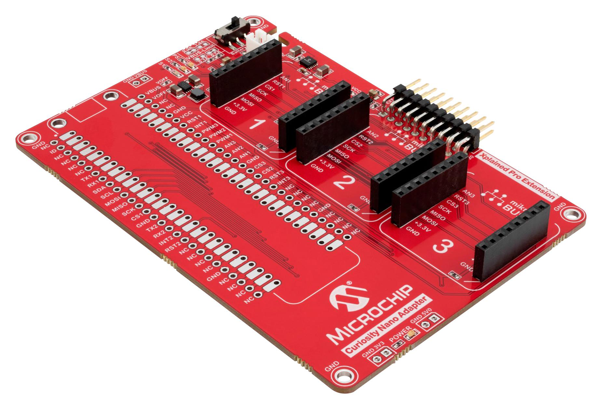
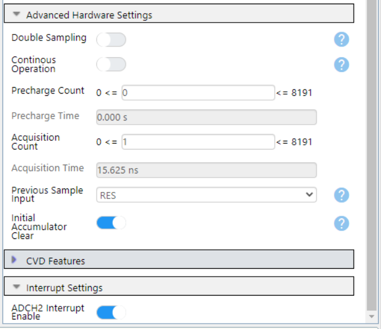
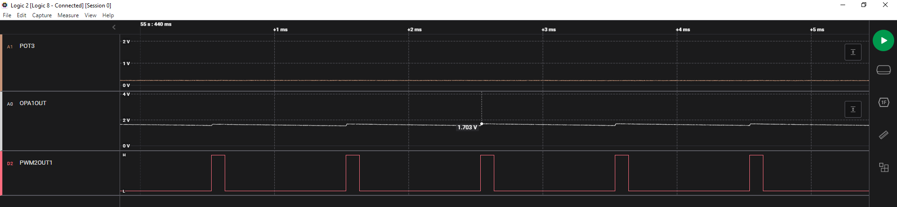
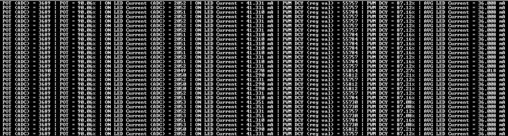

# Operational Amplifier (OPA) — LED Current Control with OPA, ADC and PWM Using the PIC18F56Q71 Microcontroller with MCC Melody

This code example demonstrates how to control the LED current using a Pulse-Width Modulation (PWM) signal, an Operational Amplifier (OPA) and the Analog-to-Digital Converter (ADC). The LED in series with a current limiting resistor are connected to the drain of an 2N7000 N-channel MOSFET and they are powered by a 5V supply. The source of the transistor is connected to ground through a shunt resistor. This circuit assembly is facilitated by the use of a PROTO Click board™. A PWM signal is used to drive the gate of the transistor. The voltage drop across the shunt resistor is amplified by the OPA, in Inverting Programmable Gain configuration, and measured by the ADC. The gain of the OPA is configured by enabling the built-in resistor ladder. A POT 3 Click board is used to set the LED current by altering the duty cycle of the PWM signal. Based on the maximum allowed LED current specific to the circuit, additional duty cyle adjustment is required to account for the LED's thermal runaway. The ADC is configured in Average mode and context switching is used to read the outputs of the OPA and the potentiometer.

## Related Documentation

More details and code examples on the PIC18F56Q71 can be found at the following links:

- [PIC18-Q71 Product Family Page](https://www.microchip.com/en-us/products/microcontrollers-and-microprocessors/8-bit-mcus/pic-mcus/pic18-q71)
- [PIC18F56Q71 Code Examples on GitHub](https://github.com/orgs/microchip-pic-avr-examples/repositories?q=pic18f56q71&type=all&language=&sort=)

## Software Used

- [MPLAB® X IDE](http://www.microchip.com/mplab/mplab-x-ide) v6.10 or newer
- [MPLAB® XC8](http://www.microchip.com/mplab/compilers) v2.41 or newer
- [PIC18F-Q Series Device Pack](https://packs.download.microchip.com/) v1.20.405 or newer

## Hardware Used

- The [PIC18F56Q71 Curiosity Nano](https://www.microchip.com/en-us/development-tool/EV01G21A) development board is used as a test platform:
   

- [Curiosity Nano Adapter](https://www.microchip.com/en-us/development-tool/AC164162):
   

- [PROTO CLICK board](https://www.mikroe.com/proto-click) (mikroBUS™ socket 1):
   

- [POT 3 CLICK board](https://www.mikroe.com/pot-3-click) (mikroBUS socket 2):
   

- External components:
  - One LED
  - One 2N7000 N-channel MOSFET
  - Three resistors:
    -  RG = 180Ω (optional)
    -  RD = 56Ω (current limiting resistor)
    -  RSH = 10Ω (shunt resistor)
  - One capacitor: C1 = 220 nF (OPA Peak Detect configuration)

 

## Equivalent simplified schematic

   

  The LED current can be determined using the following formula: ILED = (VS - VF) / (RD + RDS + RSH) where:
  - VS is the supply source voltage
  - VF is the LED's forward voltage
  - VDS is the transistor's drain-to-source on-sate resistance

  Assuming the LED's forward voltage is 2V [according to the data sheet](https://www.sparkfun.com/products/10820), the transistor's drain-to-source resistance is 5Ω [according to the data sheet](https://www.onsemi.com/pdf/datasheet/nds7002a-d.pdf), and the supply source voltage is 5V, the LED current when the transistor is switched on is 42.25 mA. This translates into a voltage drop of 422.5 mV across the shunt resistor. With the gain set to 4, the OPA will output approximately 1.7V. Based on these calculations, a maximum average LED current of 40 mA is set in software.

  The C1 capacitor is required to use the OPA in Peak Detect configuration. This configuration allows the ADC to sample the OPA's output even when the MOSFET is driven at low PWM duty cycles.
 

## Operation

To program the Curiosity Nano board with this MPLAB® X project, follow the steps provided in the [How to Program the Curiosity Nano Board](#how-to-program-the-curiosity-nano-board) chapter. 

## Setup

The following configurations must be made for this project:

- Clock Control:
  - Clock Source: HFINTOSC
  - HF Internal Clock: 64 MHz
  - Clock Divider: 1

   

- Configuration bits:
  - WDT operating mode: WDT disabled

   

- Interrupt Manager:
  - Enable Vectored Interrupt: Yes

   
   

- PWM2:
  - Enable PWM: Yes
  - Clock Source: HFINTOSC
  - Clock Prescaler: No prescale
  - Mode: Left-aligned mode
  - Requested Frequency: 1 kHz
  - Output1 Duty Cycle: 1%
  - Invert Output1 Polarity: No
  - Period Interrupt Enable: Yes
  - Period Interrupt Postscaler: No postscale
  
   
   

- OPA1:
  - Enable Op Amp: Yes
  - Enable Internal Output: No
  - Op Amp Configuration: Inverting Programmable Gain Amplifier
  - Positive Channel: OPA1IN+
  - Positive Source Selection: OPA1IN2+
  - Negative Channel: GSEL
  - Negative Source Selection: OPA1IN1-
  - Resistor Ladder: Enabled
  - Internal Resistor Ladder Selection: R1=4R and R2=12R, R2/R1=3
  - Feedback Mode: OPA1OUT
  - Hardware Override: Yes
  - Hardware Override Source Selection: Logic high
  - Override Control High Configuration: Peak detect configuration with user defined feedback
  - Peak/Trough Detect Reset: No reset
  - Override Source Polarity: Non-inverting

   
   

- FVR:
  - Enable FVR: Yes
  - FVR buffer gain to ADC: 2x (2.048V)
  - FVR buffer gain to other peripehrals: Off
  
   

- ADC:
  - Enable ADC: Yes
  - Input Configuration: Single ended mode
  - Auto-conversion Trigger Source: Disabled
  - Result format: Left justified
  - VDD: 3.3V
  - Clock Selection: FOSC
  - Clock Divider: FOSC/64
  - ADI Interrupt Enable: Yes
  - Context 1:
    - Positive Channel Selection: ANA1
    - Positive Voltage Reference: VDD
    - Operation Mode: Average mode
    - Threshold Interrupt Mode: Enabled
    - Repeat Threshold: 16
    - Accumulator Right Shift: 4
    - Double Sampling: No
    - Continous Operation: No
    - Acquisition Count: 1
    - Initial Accumulator Clear: Yes
    - ADCH1 Interrupt Enable: Yes
  - Context 2:
    - Enable Context 2: Yes
    - Positive Channel Selection: ANA2
    - Positive Voltage Reference: FVR
    - Operating Mode: Average mode
    - Threshold Interrupt Mode: Enabled
    - Repeat Threshold: 16
    - Accumulator Right Shift: 4
    - Double Sampling: No
    - Continous Operation: No
    - Acquisition Count: 1
    - Initial Accumulator Clear: Yes
    - ADCH2 Interrupt Enable: Yes
  
   
   
   
   
   

- UART2
    - Requested Baudrate: 115200
    - Parity: None
    - Data Size: 8
    - Stop Bits: 1
    - Redirect Printf to UART: Yes
    - Interrupt Driven: No
    - UART PLIB Selector: UART2

     

| Pin |     Configuration     |        Description     |
| :-: | :-------------------: | :--------------------: |
| RA1 |  Analog input/output  |     ADCPCH1/OPA1OUT    |
| RA2 |     Analog input      |          ADCPCH2       |
| RA4 |     Analog input      |          OPA1IN1-      |
| RA5 |     Analog input      |          OPA1IN2+      |
| RB0 |    Digital output     |          PWM2OUT1      |
| RB4 |    Digital output     |          UART2TX       |

 
 

 

## Demo

- Board setup:
   
   
   
 

- Logic analyzer and serial terminal captures:
  - Potentiometer position: 10%
   
   

  - Potentiometer position: 50%
   
   

  - Potentiometer position: 90%
   
   

## Summary

This code example shows how to control the LED current using the OPA, ADC and PWM peripherals.
 

[Back to Top](#operational-amplifier-opa--led-current-control-with-opa-adc-and-pwm-using-the-pic18f56q71-microcontroller-with-mcc-melody)
 

## How to Program the Curiosity Nano Board

This chapter demonstrates how to use the MPLAB X IDE to program a PIC® device with an `Example_Project.X`. This is applicable to other projects.

1.  Connect the board to the PC.

2.  Open the `Example_Project.X` project in MPLAB X IDE.

3.  Set the `Example_Project.X` project as main project:
     Right click the project in the **Projects** tab and click Set as Main Project.
     

4.  Clean and build the `Example_Project.X` project:
     Right click the `Example_Project.X` project and select Clean and Build.
     

5.  Select PICxxxxx Curiosity Nano in the Connected Hardware Tool section of the project settings:
     Right click the project and click Properties.
     Click the arrow under the Connected Hardware Tool.
     Select PICxxxxx Curiosity Nano (click the SN), click **Apply** and then **OK**:
     

6.  Program the project to the board:
     Right click the project and then Make and Program Device.
     

 

- [Operational Amplifier (OPA) — LED Current Control with OPA, ADC and PWM Using the PIC18F56Q71 Microcontroller with MCC Melody](#operational-amplifier-opa--led-current-control-with-opa-adc-and-pwm-using-the-pic18f56q71-microcontroller-with-mcc-melody)
  - [Related Documentation](#related-documentation)
  - [Software Used](#software-used)
  - [Hardware Used](#hardware-used)
  - [Equivalent simplified schematic](#equivalent-simplified-schematic)
  - [Operation](#operation)
  - [Setup](#setup)
  - [Demo](#demo)
  - [Summary](#summary)
  - [How to Program the Curiosity Nano Board](#how-to-program-the-curiosity-nano-board)
